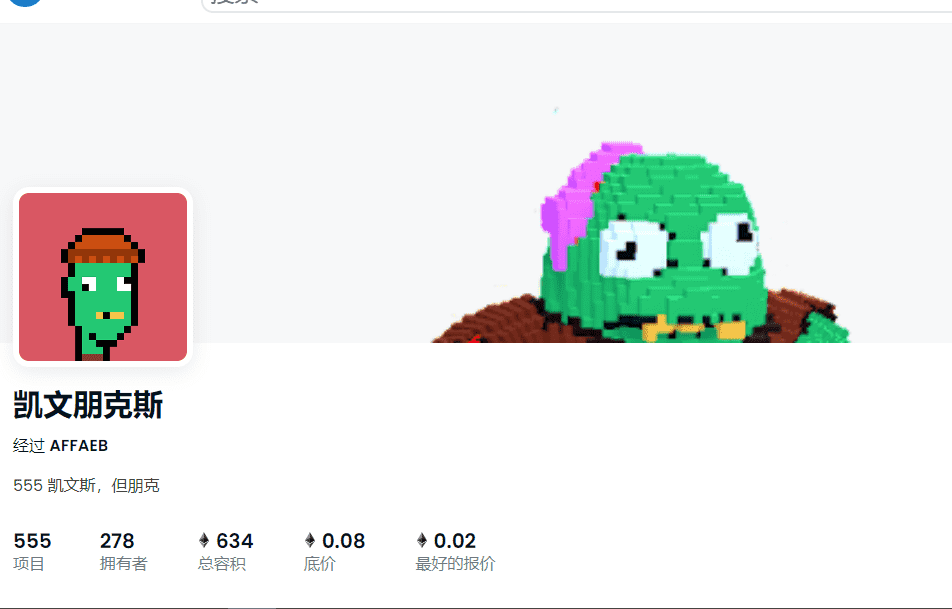

# Kevin Punks

▶ 什么是凯文朋克？
Kevin Punks 是一个 NFT（非同质代币）集合。存储在区块链上的数字艺术品集合。
▶ 有多少 Kevin Punks 代币？
总共有 555 个 Kevin Punks NFT。目前，278 位车主的钱包中至少有一个 Kevin Punks NTF。
▶ Kevin Punks 最昂贵的一次拍卖是什么？
售出的最昂贵的 Kevin Punks NFT 是 Kevin Punks #384。它于 2022 年 7 月 1 日（2 个月前）以 202 美元的价格售出。
▶ 最近卖出了多少凯文朋克？
过去 30 天内售出了 28 个 Kevin Punks NFT。
▶ Kevin Punks 的价格是多少？
在过去的 30 天里，Kevin Punks 最便宜的 NFT 销售额低于 75 美元，最高销售额超过 166 美元。过去 30 天内，Kevin Punks NFT 的中位价格为 104 美元。

