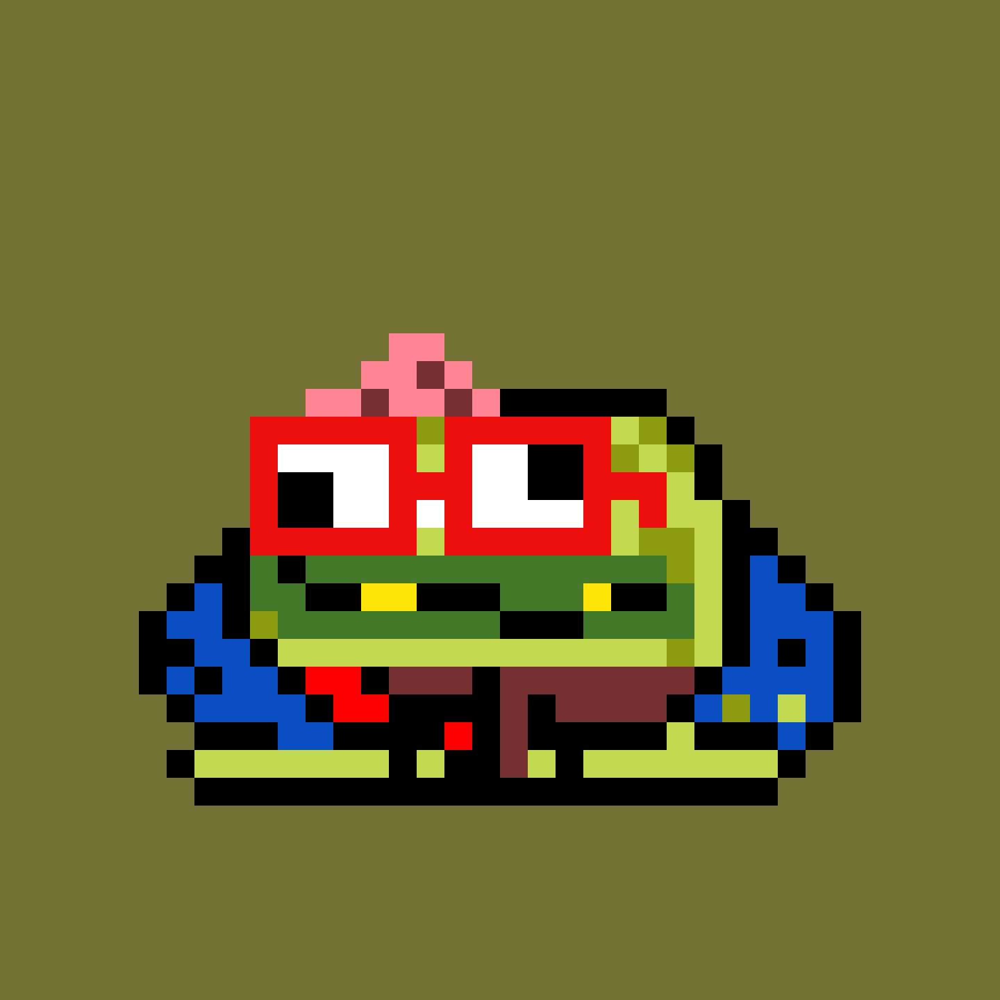

# KevinToadz by CC0LABS

**CC0LABS 统计的 KevinToadz**

创建于 6 个月前

6,969 代币供应

5% 费用

过去 7 天内没有售出 CC0LABS 的 KevinToadz。

KevinToadz 是 6969 种小型两栖凯文生物的集合。由 CC0LABS 创建。

该项目属于公共领域。随意以任何你想要的方式使用 toadz。实验艺术。没有路线图，没有实用程序，并且绝对没有承诺。

关注@cc0labs，了解即将推出的 RAGE AGAINST LE MEME (4/20/2022)、NFTL (4/28/2022) 等。

CC0LABS NFT 的 KevinToadz - 常见问题（FAQ）
▶ CC0LABS 的 KevinToadz 是什么？
CC0LABS 的 KevinToadz 是一个 NFT（不可替代令牌）集合。存储在区块链上的数字艺术品集合。
▶ CC0LABS 代币的 KevinToadz 有多少？
CC0LABS NFT 总共有 6,969 个 KevinToadz。目前，230 位业主的钱包中至少有一个 CC0LABS NTF 的 KevinToadz。
▶ CC0LABS 的 KevinToadz 最近卖出了多少？
过去 30 天内售出 0 个由 CC0LABS NFT 制作的 KevinToadz。

