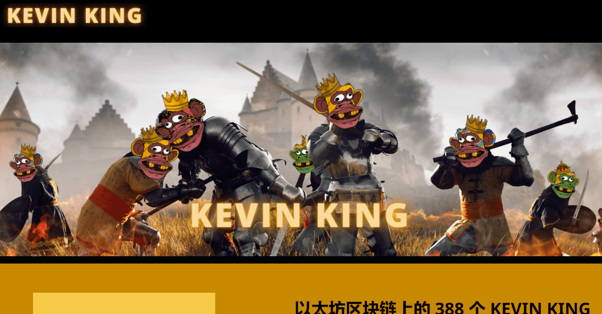

# Kevin Yacht Club Official

以太坊区块链上的 388 个 KEVIN KING NFT。像国王一样摇滚。你理应成为 NFT 之王。凯文为 NFT 文化！

▶ 什么是凯文游艇俱乐部官员？
Kevin Yacht Club Official 是一个 NFT（非同质代币）集合。存储在区块链上的数字艺术品集合。
▶ 有多少 Kevin Yacht Club 官方代币？
总共有 555 个 Kevin Yacht Club 官方 NFT。目前，208 位船东的钱包中至少有一个 Kevin Yacht Club Official NTF。
▶ 最昂贵的凯文游艇俱乐部官方销售是什么？
售出的最昂贵的 Kevin Yacht Club Official NFT 是 Kevin Yacht Club #133。它于 2022-06-21（3 个月前）以 7.4 美元的价格售出。
▶ 最近卖出了多少 Kevin Yacht Club Official？
过去 30 天内售出了 2 个 Kevin Yacht Club 官方 NFT。

