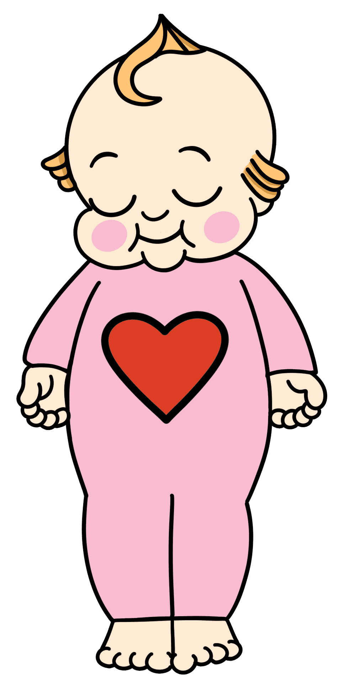

# Kewpies

什么是丘比？
Kewpies 是以太坊区块链上 10,000 个独特 NFT 的生成项目。

它们由音乐行业插图和设计团队 H.E Creative 手绘，迄今为止，他为 Avenged Sevenfold 售罄的 Death Bats Club NFT、Goth Girlfriends NFT 创作了艺术品，并为 Phoebe Bridgers、MTV、Kanye West、Pharrell Williams 制作了艺术品, Sick of it All, The Gaslight Anthem, H.R of Bad Brian's, H2O, NOFX, Epitaph Records, Salem 等等。

为什么我们开始了 Kewpies？
H.E Creative 正在以完全内部团队的身份进入元宇宙，我们创建了 Kewpies 以更好地理解和学习如何构建从艺术品到薄荷的项目。在这个项目中，我们绘制了所有内容，编码和开发了 NFT 和合约，构建了网页并将运行铸币。我们是音乐行业领域第一个这样做的完全内部团队。

我们也将这个项目视为行善的容器。 5% 的铸造利润和次要销售额将捐赠给 SIDS（婴儿猝死综合症）慈善机构 The Lullaby Trust。

进一步的利润将用于帮助我们在这个领域发展团队，包括雇用新成员和帮助在大流行后促进我们当地的经济。

