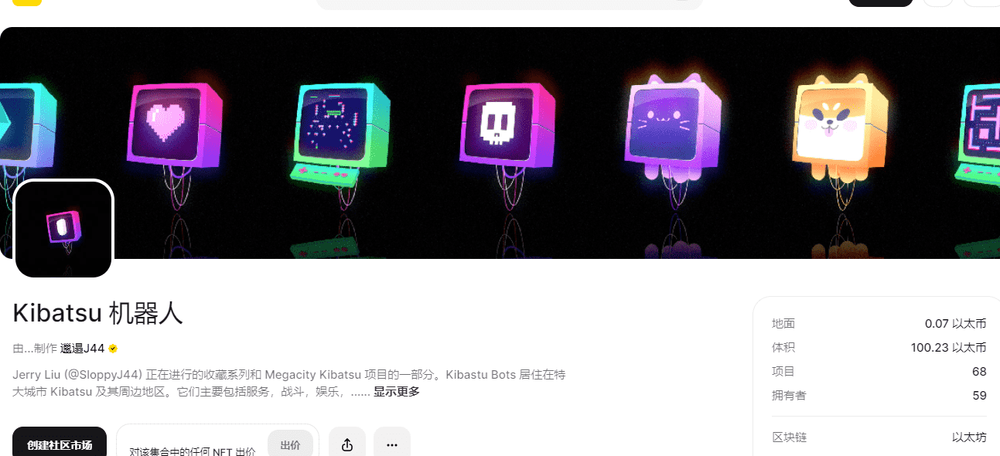

# Kibatsu Bots

▶ 什么是 Kibatsu 机器人？
Kibatsu Bots 是一个 NFT（不可替代代币）集合。存储在区块链上的数字艺术品集合。
▶ Kibatsu Bots 代币有多少？
总共有 10 个 Kibatsu Bots NFT。目前，57 位所有者的钱包中至少有一个 Kibatsu Bots NTF。
▶ Kibatsu Bots 最昂贵的交易是什么？
出售的最昂贵的 Kibatsu Bots NFT 是 Meow_Bot。它于 2022-06-11（3 个月前）以 416 美元的价格售出。
▶ 最近售出了多少 Kibatsu Bot？
过去 30 天内售出 1 个 Kibatsu Bots NFT。

