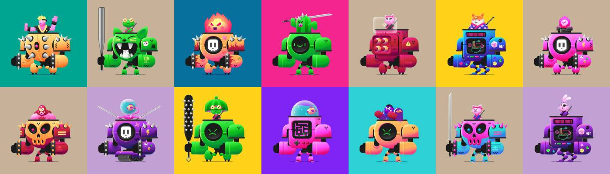

# Kibatsu Mecha

Kibatsu Mecha 是以太坊区块链上 2222 个独特的 1/1 手工生成的全动画 NFT 的集合。 这是 Kibatsu Corp. 品牌的创世纪系列，也是 Megacity Kibatsu 传说的组成部分，这是一个由艺术家和动画师 Jerry Liu（又名 SloppyJ44）开发的世界和故事

什么是木畑机甲？
Kibatsu Mecha是NFT（不可替代令牌）的集合。存储在区块链上的数字艺术品的集合。
▶ 有多少个木畑机甲代币存在？
总共有2，222个Kibatsu Mecha NFT.目前有1，410个所有者在他们的钱包中至少有一个Kibatsu Mecha NTF。
▶ 木畑机甲最贵的销售是什么？
最昂贵的Kibatsu Mecha NFT是Kibatsu Mecha #785。它在2022-06-06（3个月前）以$ 399的价格出售。
▶ 最近卖了多少木畑机甲？
在过去的30天内，售出了67个Kibatsu机甲NFT。
▶ 木畑机甲多少钱？
在过去的30天里，最便宜的Kibatsu Mecha NFT销量低于99美元，最高的销售额超过205美元。Kibatsu Mecha NFT的中位价格是过去30天内的115美元。
▶ 什么是流行的Kibatsu机甲替代品？
许多拥有Kibatsu Mecha NFT的用户也拥有Kibatsu Mecha Specials，LetsWalk，Zodiac Capsules和Sampu。

