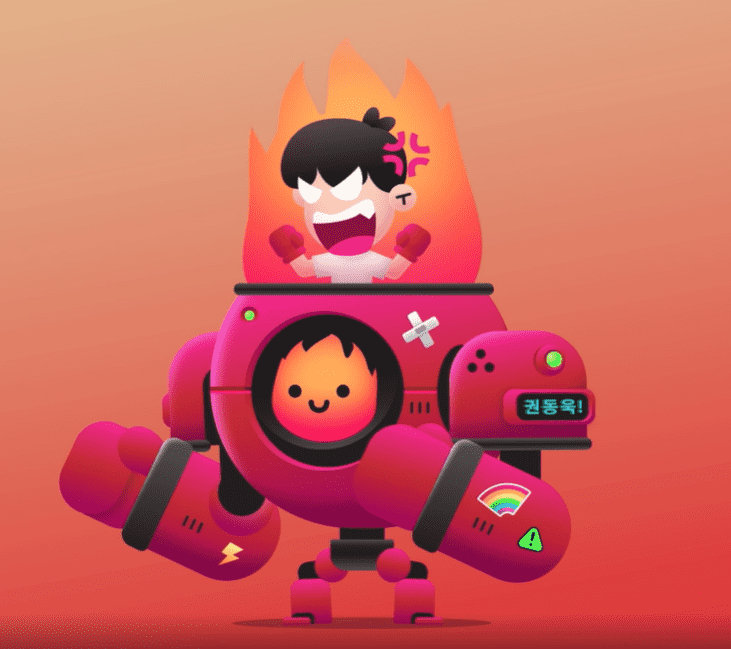

# Kibatsu Mecha Specials

Kibatsu Mecha Special 包含英雄、boss、合作等等！

木矢机甲特惠NFT - 常见问题（FAQ）
▶ 什么是木畑机甲特惠？
Kibatsu Mecha Specials是NFT（不可替代令牌）集合。存储在区块链上的数字艺术品的集合。
▶ 有多少木叶机甲特价代币存在？
总共有3个Kibatsu Mecha Specials NFT.目前有136个所有者在他们的钱包中至少有一个Kibatsu Mecha Specials NTF。
▶ 木畑机甲特价销售的最贵的是什么？
最昂贵的Kibatsu Mecha Specials NFT售出的是DeeKay Fire！它在2022-06-06（3个月前）以$ 453.4的价格出售。
▶ 最近售出了多少台木杯机甲特价商品？
在过去的30天内，有11个Kibatsu Mecha Specials NFT售出。
▶ 木畑机甲特惠多少钱？
在过去的30天里，最便宜的Kibatsu Mecha Specials NFT销量低于132美元，最高销量超过435美元。 Kibatsu Mecha Specials NFT的中位价在过去30天是174美元。
▶ 什么是流行的Kibatsu机甲特价替代品？
许多拥有Kibatsu Mecha Specials NFT的用户也拥有Graveyard CRYPTS，Doki Doki，Tiny Heroes和Kibatsu Mecha。

