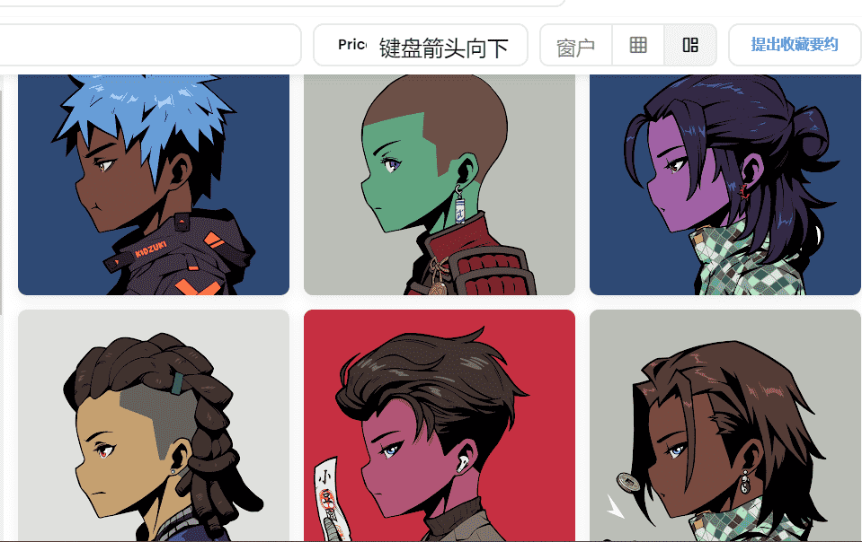

# Official Kidzuki

Kidzuki 一开始收集了 5,555 个头像，您可以通过这些头像访问 Kidz 社区：这是互联网的一个角落，学生、教师和 web3 爱好者在这里聚会，创造一个去中心化的未来。Kidzuki 持有者可以获得独家掉落、体验等。访问]了解更多详情。官方 Kidzuki 是存储在以太坊区块链上的 5,555 件 NFT 收藏。官方 Kidzuki NFT 的当前底价为 0.01 ETH - 16.92 美元。Official Kidzuki 的总销售额为 361 ETH - 610,219.85 美元，拥有 1895 名所有者。官方 Kidzuki 是一个 NFT（非同质代币）集合。存储在以太坊区块链上的数字艺术品集合。

