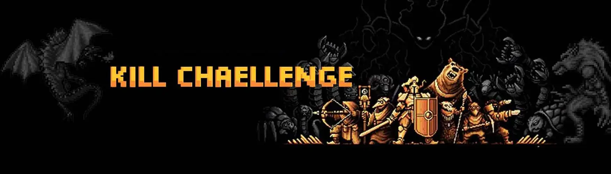

# Kill Challenge

Kill Challenge NFT - 常见问题（FAQ）
▶ 什么是杀戮挑战？
Kill Challenge 是一个 NFT（不可替代令牌）集合。 存储在区块链上的数字艺术品集合。
▶ 有多少杀戮挑战代币？
总共有 2,725 个 Kill Challenge NFT。 目前，1,953 位车主的钱包中至少有一个 Kill Challenge NTF。
▶ 什么是最昂贵的杀戮挑战销售？
售出的最昂贵的 Kill Challenge NFT 是 KILL CHALLENGE #2648。 它于 2022-06-20（2 个月前）以 16.5 美元的价格售出。
▶ 最近卖出了多少杀戮挑战？
过去 30 天内售出了 10 个 Kill Challenge NFT。
▶ 什么是流行的杀戮挑战替代品？
许多拥有 Kill Challenge NFT 的用户还拥有 CivilizedApe、Women in Tech AI、Super Painting Artwork 和 Party Crasherz。

