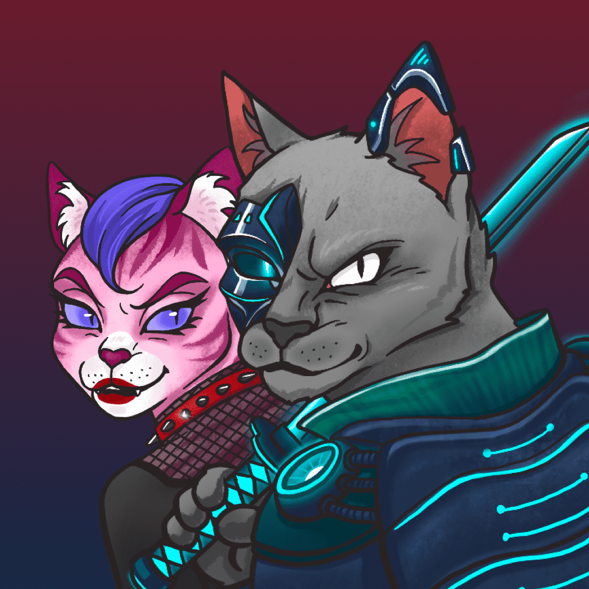

# Yakuza Cats Society - The Killers

Yakuza Cats Society - The Killers 是独一无二的随机生成的杀手猫，被招募来加强元宇宙的 Yakuza Cats 集团。 新兵不断被 Kobuns 发现，因为他们在城市中搜寻这些未被发现的主人。 这些杀手猫无疑将有助于扩大 Yakuza Cats 的领土！

什么是黑帮猫协会 - 杀手？
Yakuza Cats Society - The Killers是NFT（不可替代令牌）的集合。存储在区块链上的数字艺术品的集合。
▶ 有多少个Yakuza猫协会 - 杀手令牌存在？
总共有1，913个Yakuza猫协会 - 杀手NFT.目前有462个所有者在他们的钱包里至少有一个Yakuza猫协会 - 杀手NTF。
▶ 什么是最昂贵的雅库扎猫协会 - 杀手出售？
最昂贵的Yakuza Cats Society - The Killers NFT出售的是KillerCats #933。它在2022-06-07（3个月前）以$ 50.8的价格出售。
▶ 最近卖了多少个Yakuza猫协会 - 杀手？
在过去的30天内，有6个Yakuza Cats Society - The Killers NFT售出。
▶ 什么是流行的Yakuza猫协会 - 杀手替代品？
许多拥有Yakuza Cats Society - The Killers NFTs的用户也拥有ZombieZ，The Yakuza Cats Society，Wall St Moms和CurrumPunks。

