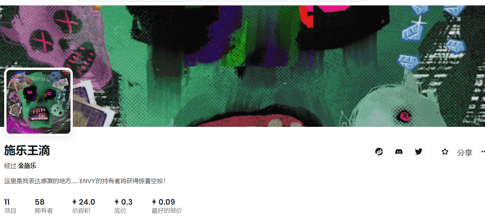

# KING XEROX DROPS

▶ 什么是 KING XEROX DROPS？
KING XEROX DROPS 是一个 NFT（不可替代令牌）集合。存储在区块链上的数字艺术品集合。
▶ 有多少 KING XEROX DROPS 代币？
总共有 10 个 KING XEROX DROPS NFT。目前，57 位所有者的钱包中至少有一个 KING XEROX DROPS NTF。
▶ 什么是最昂贵的 KING XEROX DROPS 销售？
售出的最昂贵的 KING XEROX DROPS NFT 是 ENVY。它于 2022 年 6 月 21 日（3 个月前）以 2.2 万美元的价格售出。
▶ 最近卖出了多少 KING XEROX DROPS？
过去 30 天内共售出 12 个 KING XEROX DROPS NFT。
▶ KING XEROX DROPS 的价格是多少？
过去 30 天，最便宜的 KING XEROX DROPS NFT 销售额低于 114 美元，最高销售额超过 1912 美元。过去 30 天，KING XEROX DROPS NFT 的中位价格为 163 美元。

