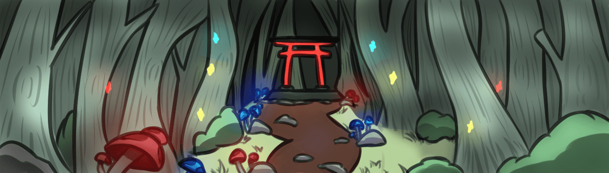

# Kinto Mori

来自隐藏的森（森林）的 3333 种具有独特可爱特征的卡哇伊生物的集合，他们即将发现令人敬畏的艺术家和神秘创造者的虚拟世界。 加入不和谐

金藤森NFT - 常见问题（FAQ）
▶ 什么是金户森？
Kinto Mori是NFT（不可替代令牌）的集合。存储在区块链上的数字艺术品的集合。
▶ 金藤森代币有多少个？
总共有1，176个Kinto Mori NFT.目前有170个所有者在他们的钱包中至少有一个Kinto Mori NTF。
▶ 近日卖了多少金户森？
在过去的30天内售出了0个Kinto Mori NFT。

