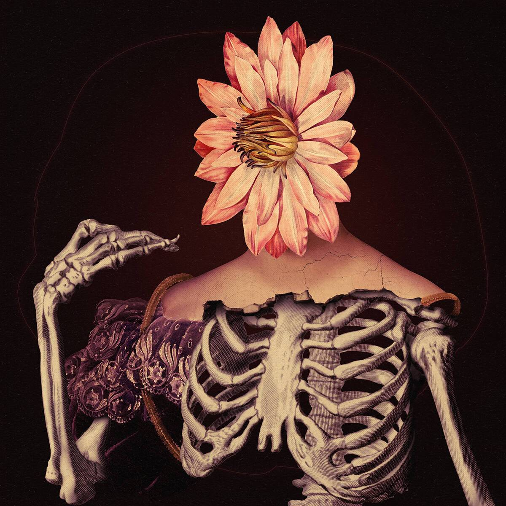

# Kittball

在过去的7天里，没有卖掉Kittball。Kittball 系列是艺术家 mendezmendez、Kittball Records 和 It Began In Africa Charity x Africa Children Choir 之间的创造性合作。 

小猫 NFT - 常见问题（FAQ）
▶ 什么是小猫球？
Kittball是一个NFT（不可替代令牌）集合。存储在区块链上的数字艺术品的集合。
▶ 有多少个小猫球代币存在？
总共有15个Kittball NFT.目前有79个所有者在他们的钱包里至少有一个Kittball NTF。
▶ 最近卖了多少小猫球？
在过去的30天内售出了0个Kittball NFT。

