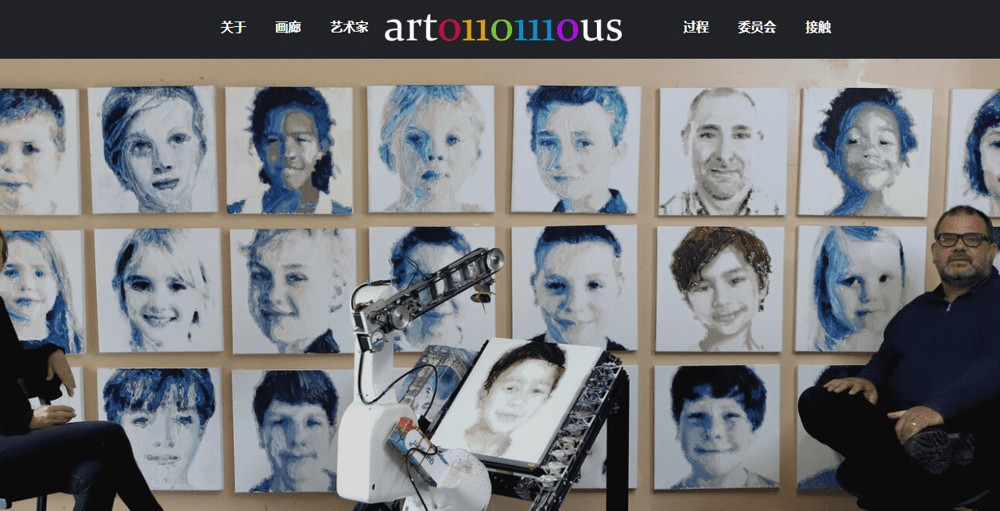

# Kittys Bar Drinks Shop

artonomous 是一种人工智能机器，可以用画笔在画布上作画。虽然它已经可以画出与人类相当的肖像画，但摄影师 Kitty Simpson 和 AI 艺术家 Pindar Van Arman 已经联手教它美术的微妙之处。Kitty 将与机器人分享她令人回味的摄影作品，而 Pindar 将重新编程其 AI 以尽可能多地向她学习。三人将合作创作一系列有限的画作，因为他们将机器人的肖像画磨练成美术。虽然该机器人已经绘制了数千幅肖像并因其作品获得国际认可，但它的艺术之旅才刚刚开始。Kitty 和 Pindar 相信，通过使用传统的艺术技巧和人工智能的最新进展，他们将能够将 artonomous 的作品推向更具表现力的方向。

