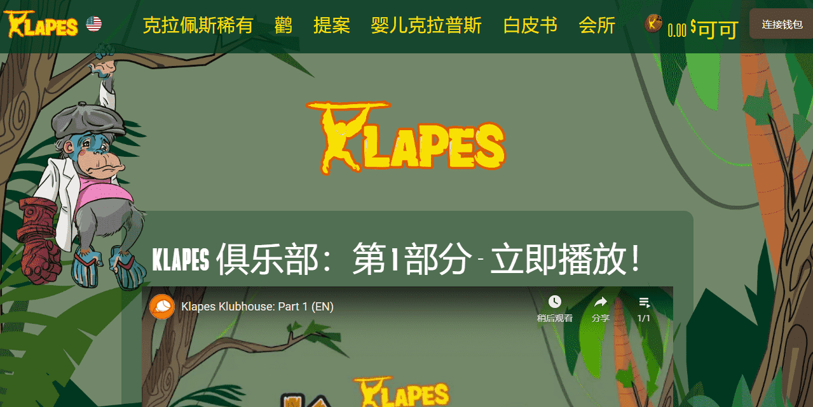

# Klapes

Klapes 是一个包含 5,000 个以编程方式生成的 NFT 的项目，这些 NFT 完全独一无二，100% 归您所有。Klapes 建立在 Klaytn 区块链上，让您可以加入一个有趣的社区，在那里您可以收集并与您的朋友分享您的 Klapes。

冒险在古坦岛上等待！与您的 Klapes 和 Baby Klapes 同伴一起前往古坦岛寻找稀有、独特的宝藏 NFT！在岛上的 Klubhouses 收集 Koconut ($KOCO) 进行寻宝冒险，但要小心恶毒的 Klompsters，他们会吓跑您的 Baby Klapes 远离 Koconuts！用 Klapes 保护您的 Baby Klapes 以抵御 Klompster 攻击，尽可能多地收集 $KOCO，并成为少数幸运儿之一，收集独家 1 of 1 宝藏 NFT！

