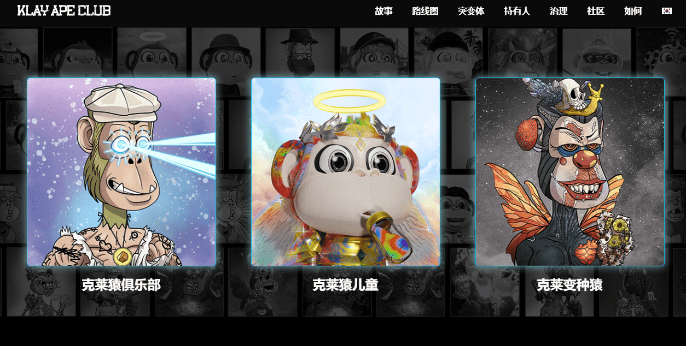

# KLAY APE CLUB

漫画家“HAPPY D”制作，沙盒游戏 P2E , 3X3 地产

向儿童癌症基金会捐赠 1000 万韩元拥有 Klay ape NFT 并成为我们的高级会员。

因气体爆炸而面临生存危机的“以太坊”星球。暴露在空气中的气体变异成致命的快乐病毒，被
感染的幸存者在余生中傻笑，由于内啡肽分泌过多，寿命很短……

逃离以太坊星球的瓦斯爆炸和环境污染的猿猴们（v1）登陆克莱特星球，与公主KIKI相遇。爱上公主，APE KIDS (v2) 诞生。

然而，没有来到克莱特星球而留在以太星球上的APE（v1）由于污染更严重，被僵尸化的BAYC#8944咬伤，并随着严重的僵尸病毒开始变异……

