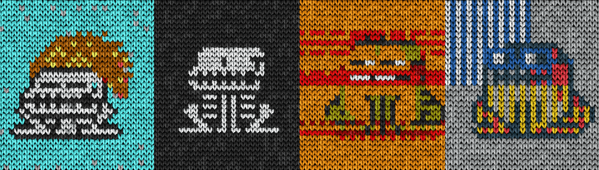

# Knitoadz

在过去的7天里，没有出售Knitoadz。

针织蟾蜍是数码编织蟾蜍。总共300个在收藏中。没有 DAO。无效用。没有路线图。只是编织蟾蜍。Knitoadz 是数码针织蟾蜍。 收藏总数为 300 件。 没有道。 没有实用性。 没有路线图。 只织蟾蜍。 GREMPLIN 的 CC0 公共域 CrypToadz 的衍生产品。

Knitoadz NFT - 常见问题（FAQ）
▶ 什么是 Knitoadz？
Knitoadz 是一个 NFT（非同质代币）集合。 存储在区块链上的数字艺术品集合。
▶ 有多少 Knitoadz 代币？
总共有 300 个 Knitoadz NFT。 目前，86 位车主的钱包中至少有一个 Knitoadz NTF。
▶ 最近卖出了多少 Knitoadz？
过去 30 天内售出 0 个 Knitoadz NFT。

