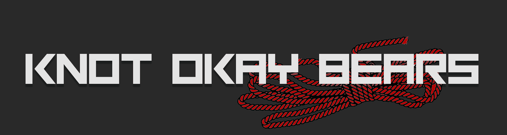

# Knot Okay Bears NFT

Knot Okay Bears 是一种文化转变。 一个变态的 Roped up 熊自愿承诺束缚于以太坊区块链。 Shibari Bearbari。 Knot Okay Bears 将在 24 小时内发布。

结 好 熊 NFT NFT - 常见问题（FAQ）
▶ 什么是结好熊NFT？
Knot Okay Bears NFT是NFT（不可替代令牌）集合。存储在区块链上的数字艺术品的集合。
▶ 有多少个结好熊NFT代币存在？
总共有1，333个Knot Okay Bears NFT NFT NFT.目前有379个所有者在他们的钱包中至少有一个Knot Okay Bears NFT NTF。
▶ 最近卖了多少只结好熊NFT？
在过去的30天内售出了0 Knot Okay Bears NFT NFT NFT。
▶ 什么是流行的结好熊NFT替代品？
许多拥有Knot Okay Bears NFT NFT NFT的用户也拥有PSYCOZ ESPORTS，hobittown.wtf，AIGods和Creature Penguins。

