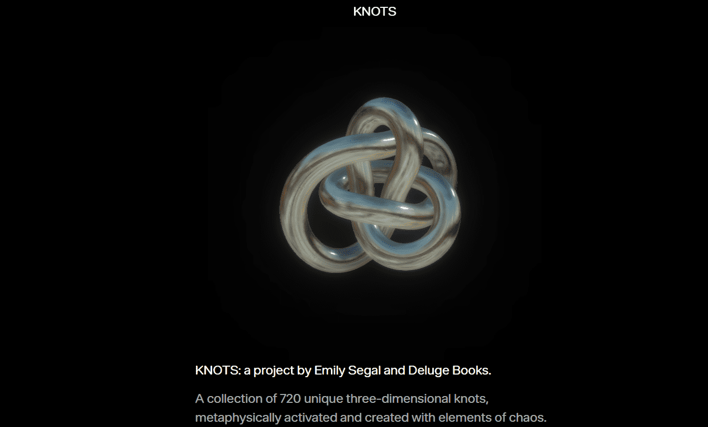

# KNOTS by Emily Segal

KNOTS：Emily Segal 和 Deluge Books 的一个项目。

720 个独特的 3D 结的集合，形而上学地激活并使用混沌元素创建。

每个 3D 渲染的结都嵌入一个完美的风水球中，以实现最大的保持者和谐。四向铸造过程意味着您获得的每个 KNOT 都与您的目标密切相关。unknot 上的 XY 坐标确定了一个随机种子，该种子授予你的结。此外，智能合约包含来自西方魔法基础文本的古老公式，由团队的占卜师和仪式专家设计。

