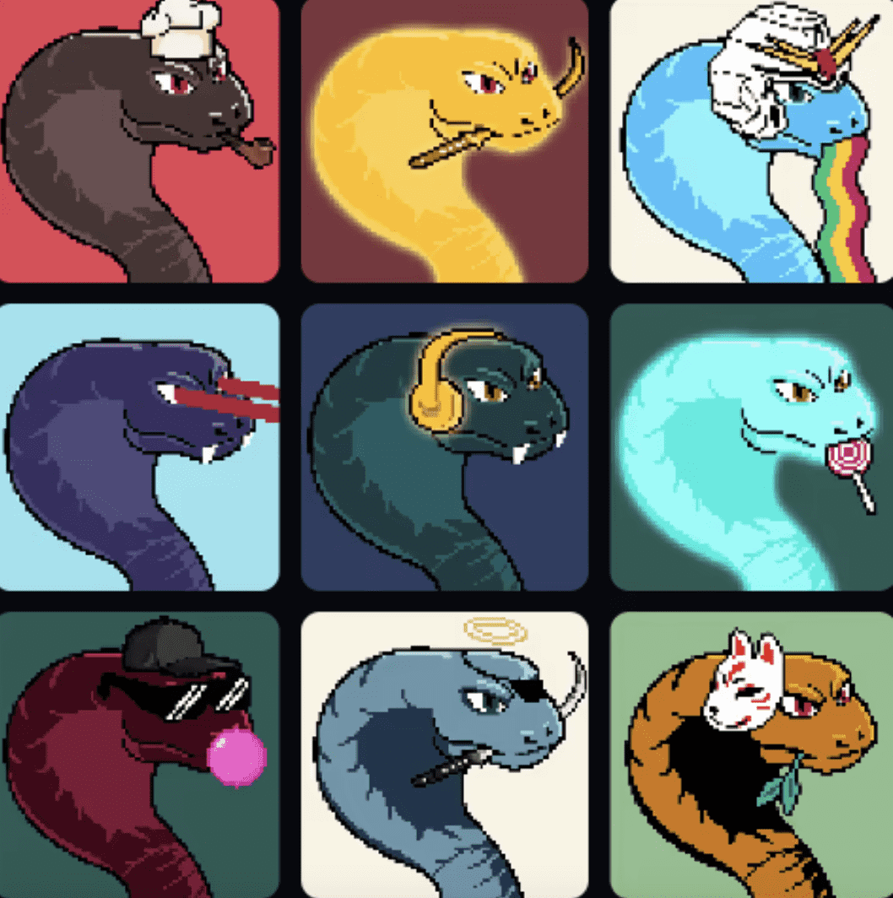

# Koburo Society

KoburoSociety 是 ETH 网络上的 2222 生成集合。 社区是关于增长的，并为 web3 的未来提供一个学习、构建、征服和额外好处的地方，你持有它们的时间越长。

常问问题
有不和谐吗？
是的。 所有重要信息将在所有社交媒体渠道和我们的网站上同步。

什么是实用程序/路线图？
基本 - 秘密 - 特殊 如果您不属于我们，您将永远不会知道！

薄荷的价格是多少？

免费+天然气

每个钱包最多 4 个

哪里可以买到小三郎？ 通过上面的铸造，然后在二级市场上，通过 OpenSea、X2Y2 和 LooksRare。

支持哪些钱包？
我们推荐使用 MetaMask，它可以从 MetaMask 网站下载。 但是欢迎使用walletconnect！

小三郎是从哪里来的？
我们的团队来自世界各地！ 你也可以成为我们的一员！

