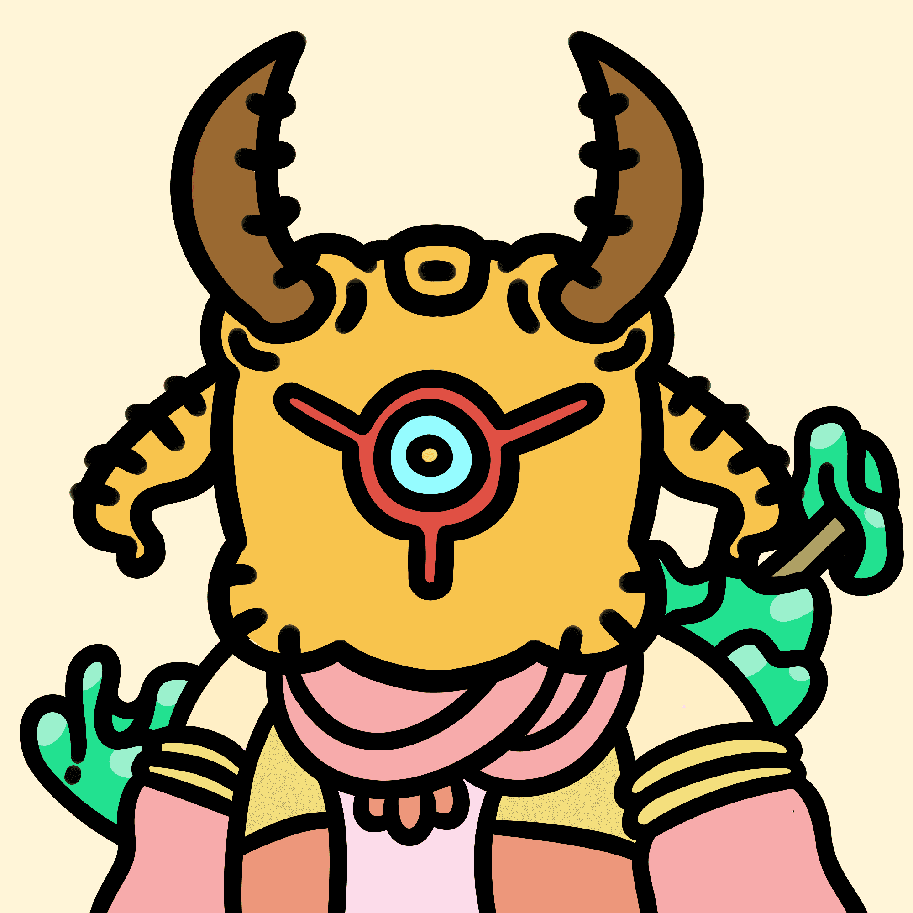

# koda frens

**柯达弗伦斯统计**

创建于 3 个月前，3,333 代币供应，6.99% 费用

过去 7 天没有售出任何 koda frens。

集合了 3333 个独特且随机生成的可爱的小柯达朋友。这些神秘生物诞生在以太坊区块链上，旨在建立异界最大最强的狂热社区。koda frens 是真正的 degens 和 moonbois，他们看起来既怪异又酷毙了。

koda frens NFT - 常见问题（FAQ）
▶ 什么是 koda frens？
koda frens 是一个 NFT（非同质代币）集合。存储在区块链上的数字艺术品集合。
▶ 有多少个 koda frens 代币？
总共有 3,333 个 koda frens NFT。目前，754 位车主的钱包中至少有一个 koda frens NTF。
▶ 最昂贵的 koda frens 销售是什么？
售出的最昂贵的 koda fren NFT 是 koda fren #1117。它于 2022-06-10（3 个月前）以 108.2 美元的价格售出。
▶ 最近卖出了多少个 koda frens？
过去 30 天内售出了 10 个 koda frens NFT。
▶ 什么是流行的 koda frens 替代品？
许多拥有 koda frens NFT 的用户还拥有 EL NUMEROS、 DegenOkayBears、 WaterBe4nZuki和 Old Legacy。

