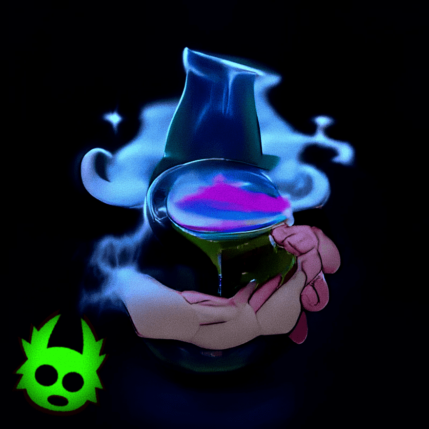

# KODAPOTIONS

**KODAPOTIONS 统计数据**

创建于 4 个月前，340代币供应，5% 费用

过去 7 天内没有售出任何 KODAPOTIONS。

Koda Potions 是 1,111 种魔法运气药水的集合，可以增加你在铸造 Yuga Labs 的“The Otherside Metaverse Land Deed”后获得 Koda 的运气（可能是 idk）。

不隶属于 Yuga Labs。

KODAPOTIONS NFT - 常见问题（FAQ）

▶ 什么是 KODAPOTIONS？

KODAPOTIONS 是一个 NFT（非同质代币）集合。存储在区块链上的数字艺术品集合。

▶ 有多少 KODAPOTIONS 代币？

总共有 340 个 KODAPOTIONS NFT。目前，138 位所有者的钱包中至少有一个 KODAPOTIONS NTF。

▶ 最近卖出了多少 KODAPOTIONS？

在过去 30 天内售出了 0 个 KODAPOTIONS NFT。

