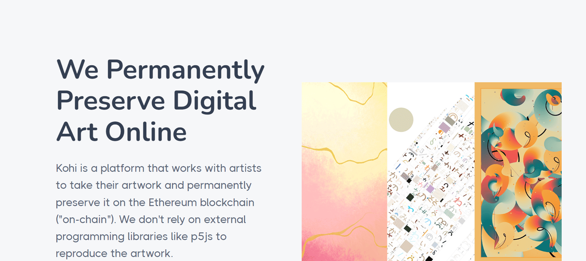

# Kohi Kintsugi

— 从日本 Kintsugi 艺术中汲取灵感，这个前卫系列颠覆了人们的期望，审视了自我与野心、完整性、力量和获取贵金属的虚假价值之间的关系。

Kintsugi 是我们的创世系列和技术测试，以证明我们的链上生成艺术品方法。拥有 Kintsugi 直接支持我们的平台，并作为未来收藏的早期薄荷通行证。

Kintsugi 在粒子模拟中渲染 5,000-20,000 个粒子，每个粒子模拟 400 帧，以生成 kintsugi 线条。

