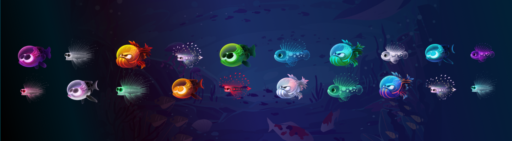

# Koi Metaverse

**锦鲤元界统计**

创建于 11 个月前，934代币供应，0% 费用

过去 7 天没有出售 Koi Metaverse。

Koi Metaverse (KoiVerse) 旨在通过为多链上的虚拟 GameFi NFT 构建数字收藏品平台来解锁下一代 GameFi 元界经济。

Koi Metaverse NFT - 常见问题（FAQ）

▶ 什么是锦鲤元宇宙？

Koi Metaverse 是一个 NFT（Non-fungible token）集合。存储在区块链上的数字艺术品集合。

▶ 存在多少 Koi Metaverse 代币？

总共有 934 个 Koi Metaverse NFT。目前 238 位所有者的钱包中至少有一个 Koi Metaverse NTF。

▶ 最近卖出了多少锦鲤元界？

过去 30 天内共售出 0 个 Koi Metaverse NFT。

