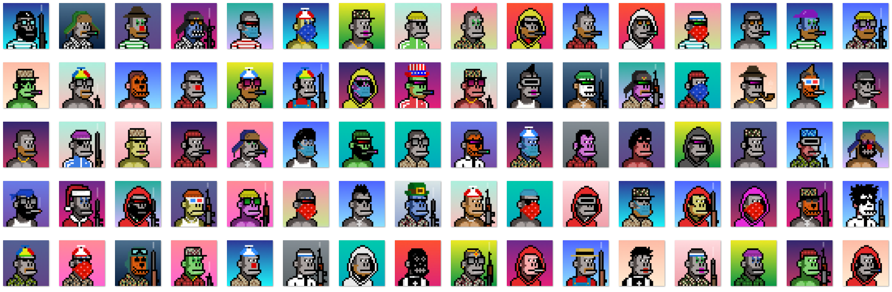

# Kongo Kingz

Kongo Kingz 是由算法生成的 10.000 只 Kongo 大猩猩的集合，并作为为 Polygon 网络构建的 ERC-721 标准令牌推出。

每一个都是独一无二的，由超过 270 种可能的特征创建而成，包括：类型、武器、服装、珠宝、眼镜、头发和帽子。

您可以使用左侧的属性下拉栏进行搜索，您会发现某些属性极为罕见。

在这个系列中，你会发现：大猩猩、白化病、外星人、僵尸、机器人、半机械人、彩色大猩猩和吸血鬼大猩猩，以及一位非常特别的刚果国王“凯撒”

