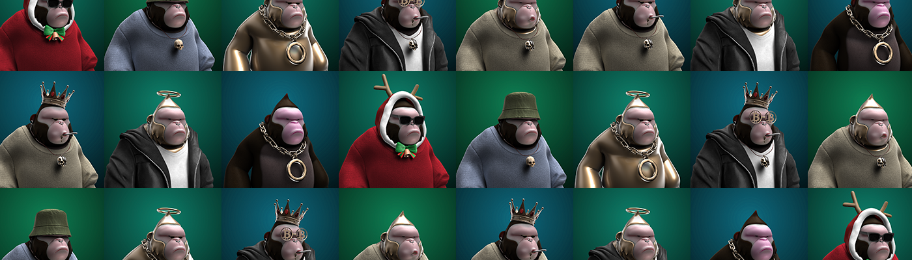

# KONGZ MINTER

我是 META KONGZ 铸币商！！！

#1。每个假期，人们都会聚集在马戏团。

在一个玻璃笼子里，他们互相梳理毛发，但即使这样也开始变得令人沮丧。
他们向外看，看到人们咯咯地笑着玩得开心，但有什么好玩的呢？
然后有一天，一张海报飞到了一只打着哈欠的大猩猩面前。海报中描绘了大猩猩的天堂。
（最完整的生态系统：新建的半月国家公园）
#2。真的有这样的地方吗？

现在大猩猩甚至不再关心训练师的热情训练了。
当他们跳过燃烧的戒指并演奏乐器时，海报中的画面浮现在他们的脑海中。
说起来，现在谁有这张海报？
大猩猩互相看了看，发现他们都是空手而归。
教练放弃并离开了房间。他一关灯，大猩猩就听到 ZAP 声！！
在马戏团里，他们下方的沙井开始发出光芒。
#3。你见过穿着长袍戴着护目镜的大猩猩吗？

在马戏团下方的一个白色实验室里，一只戴着护目镜的大猩猩正在组装一台大型发动机。
停顿了一下，大猩猩请游客坐下。然后他走向一堵墙，拉开窗帘。
两张劣质图纸和一张海报
大猩猩指着文字，歪着头说。
“还是不明白？”
文字内容为：（前往天堂/Craft and Fly）
#4。我们需要香肠来提升马戏团吗？香蕉呢？

在城市下方蜘蛛网状的下水道中，大猩猩们去寻找零件而不是回家。
大猩猩在夜间漫游城市，用珠宝装满空信封。等等，你付钱了吗？
在最后一家珠宝店，他们进入了一个摆满名表的房间。现在大猩猩明白了时间的概念。
迟早，谣言会开始在人们中间流传。人们会开始说，“小心下水道里的大猩猩之手”。

