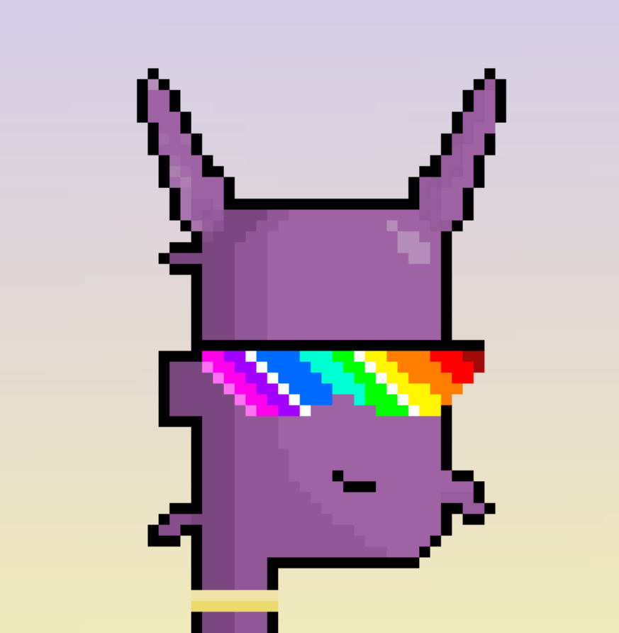

# Koooda Punkz

Kodapunkz 是以太坊区块链上 3333 个随机生成的 NFT 的集合，其中共有 33 1/1 Kodapunkz，包含独特的特权。 在这个游戏中回馈小鱼。 - 不隶属于 otherside 或 yugalabs。▶ 什么是 Koooda Punkz？
Koooda Punkz 是一个 NFT（非同质代币）集合。存储在区块链上的数字艺术品集合。
▶ 有多少 Koooda Punkz 代币？
总共有 3,333 个 Koooda Punkz NFT。目前，1,425 位车主的钱包中至少有一个 Koooda Punkz NTF。
▶ Koooda Punkz 最昂贵的销售是什么？
出售的最昂贵的 Koooda Punkz NFT 是 Kodapunkz #481。它于 2022-06-29（大约 2 个月前）以 109.8 美元的价格售出。
▶ 最近卖出了多少 Koooda Punkz？
过去 30 天内售出了 86 个 Koooda Punkz NFT。
▶ Koooda Punkz 的价格是多少？
在过去 30 天里，最便宜的 Koooda Punkz NFT 销售额低于 2 美元，最高销售额超过 11 美元。过去 30 天内，Koooda Punkz NFT 的中位价格为 3 美元。
▶ 什么是流行的 Koooda Punkz 替代品？
许多拥有 Koooda Punkz NFT 的用户还拥有 Goblin Dicks、 Bored Gutter Apes Gen 2、 Pixel Okay Bears Collective和 degenmfers.wtf。

