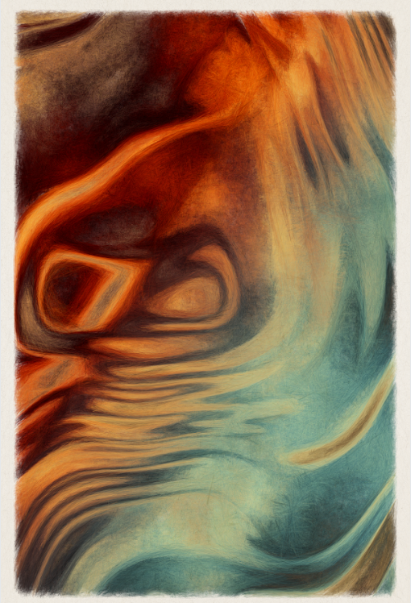

# Koripo by Rich Poole

通用汽车 工作室展示了 Rich Poole 的“Kōripo”，这是一个探索元素抽象艺术的生成系列。该系列是生成艺术平台 gm 上的第三个系列。 工作室它由 999 件组成，于 2022 年 5 月 4 日推出。Rich Poole NFT 的 Koripo 在过去 7 天内售出 38 次。Rich Poole 的《Koripo》总销售额为 9.51 万美元。Rich Poole NFT 的一个 Koripo 的平均价格为 250.2 美元。Rich Poole 拥有 559 个 Koripo，总共拥有 999 个代币。▶ Rich Poole 的 Koripo 是什么？
Rich Poole 的 Koripo 是一个 NFT（非同质代币）集合。存储在区块链上的数字艺术品集合。
▶ Rich Poole 代币有多少 Koripo？
Rich Poole NFT 总共有 999 个 Koripo。目前，559 位车主的钱包中至少有一个 Rich Poole NTF 的 Koripo。

![koripo-by-rich-poole](C:\Users\ADM IN\Desktop\0827陆浩100条\koripo-by-rich-poole\koripo-by-rich-poole.png

