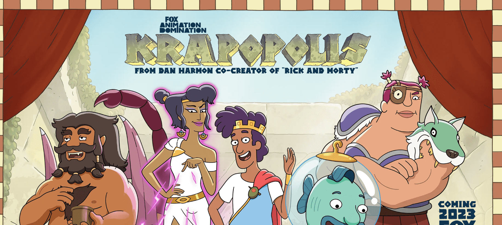

# Krapopolis Krap Chickens

在公元前 600 年开发货币之前，古希腊人不得不使用易货系统。大多数以物易物的商品都是可食用的，但易腐烂。你可能不能吃这只鸡，但你可以用它来换取比一罐橄榄油更多的东西。KRAPOPOLIS 是一部由创作者丹·哈蒙（“瑞克和莫蒂”）以神话般的古希腊为背景的动画喜剧，以一个有缺陷的人类、神和怪物家族为中心，他们试图在不互相残杀的情况下管理世界上第一座城市之一。Krap Chickens 让您以前所未有的方式参与文明的诞生。KRAPOPOLIS 于 2023 年在 FOX 首播。

