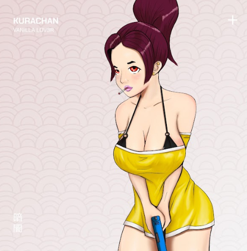

# Kurachan

Kurachan，或 kChan，是一个基于实用程序的限时收藏品，与 Kurayami 交织在一起。：可以质押以赚取 $KURA更多 kChan 质押 = 更多收益 质押在一起可提高 Kuryami 收益3 不同的稀有物品，每个都有独特的艺术和不同的收益在我们的市场中花费 $KURA▶ 什么是Kurachan？
Kurachan 是一个 NFT（非同质代币）集合。存储在区块链上的数字艺术品集合。
▶ 有多少 Kurachan 代币？
总共有 7,381 个 Kurachan NFT。目前，790 位车主的钱包中至少有一个 Kurachan NTF。
▶ 最昂贵的 Kurachan 销售是什么？
出售的最昂贵的 Kurachan NFT 是 Kurachan #4199。它于 2022-06-12（3 个月前）以 1.7 美元的价格售出。
▶ 最近卖了多少Kurachan？
过去 30 天内售出了 2 个 Kurachan NFT。

