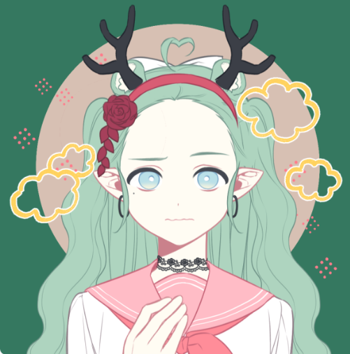

# KyotoAngels

每月 10% 回报的质押开放 - 现在注册京都天使正在冒险进入元宇宙检查我们的 - 路线图京都天使是由 UwU Mistlabs 制造的 10000 个卡哇伊娃娃的集合。 它们的灵感来自我们祖先制作的可爱娃娃。 我们选择多边形的目的是打破使用多边形网络的其他项目设置的记录。 我们努力为整个 NFT 社区提供具有大量实用程序的高质量艺术。 我们的主要目标是开发和创作与 Polygon Network 目前存在的艺术相比具有高标准和高质量的艺术。 与其他 NFT 项目相比，我们的娃娃目前还拥有最多的属性 (30) 和特征 (1704)。

