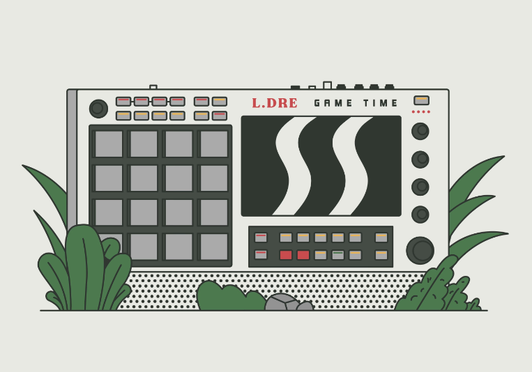

# L.Dre

Lofi Guy NFT 联合创始人 L.Dre，是一位新兴制作人，目前在全球音乐界崭露头角。 他的风格融合了柔和的 lo-fi 旋律和摇摆的 bap bap 节奏，创造出流畅、凉爽且易于聆听的声音。 最值得注意的是，他凭借对 Steven Universe 主题曲的梦幻般的低保真改编而走红。 现在，Spotify 每月有超过 100 万的听众，他在探索 web3 世界的同时继续发布音乐。▶ 什么是 L.Dre？
L.Dre 是一个 NFT（不可替代代币）集合。 存储在区块链上的数字艺术品集合。
▶ 有多少个 L.Dre 代币？
总共有 1 个 L.Dre NFT。 目前，82 位车主的钱包中至少有一个 L.Dre NTF。
▶ 最近卖出了多少 L.Dre？
过去 30 天内售出 0 个 L.Dre NFT。

