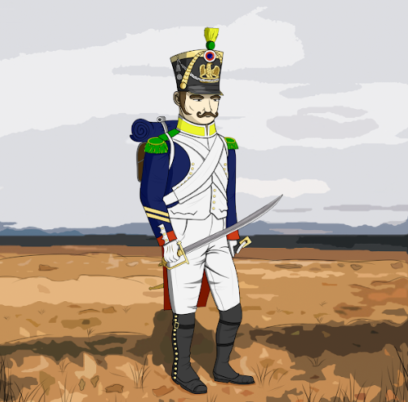

# La Grande Armee de Napoleon

La Grande Armée是拿破仑战争期间法国皇帝拿破仑·波拿巴指挥的法国帝国军的主要军事组成部分。 从 1804 年到 1809 年，它赢得了一系列军事胜利，使法兰西帝国能够对欧洲大部分地区进行前所未有的控制。

▶ 什么是拿破仑大军？
La Grande Armee de Napoleon 是一个 NFT（不可替代代币）系列。 存储在区块链上的数字艺术品集合。
▶ 有多少个 La Grande Armee de Napoleon 代币？
总共有 5,665 个 La Grande Armee de Napoleon NFT。 目前 4 位车主的钱包中至少有一个 La Grande Armee de Napoleon NTF。
▶ 最近卖出了多少 La Grande Armee de Napoleon？
过去 30 天内售出 0 个 La Grande Armee de Napoleon NFT。

