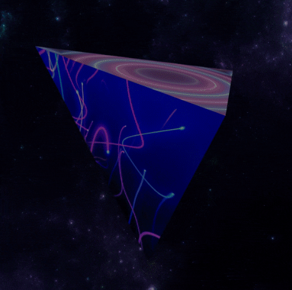

# LandSpaceship

🚀每个钱包免费薄荷+汽油1个LandSpaceship🔥✅总8888💰50% 的二次销售将分配给@RichMekas 持有者🤝💰25% - DAO💰25% - 团队无铸币土地：0 ETH + 天然气（每个钱包 1 个土地）无铸币土地：0 ETH + gas（每个 RichMeka 4 块土地）额外土地（薄荷土地）：0.01 ETH + gas（每笔交易最多 20 块土地▶ 什么是陆地宇宙飞船？
LandSpaceship 是一个 NFT（不可替代代币）集合。 存储在区块链上的数字艺术品集合。
▶ 有多少个 LandSpaceship 代币？
总共有 1,370 个 LandSpaceship NFT。 目前，300 位车主的钱包中至少有一个 LandSpaceship NTF。
▶ 最近卖出了多少艘 LandSpaceship？
过去 30 天内售出 0 个 LandSpaceship NFT。

