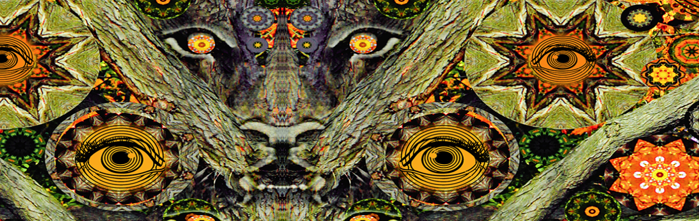

# LARRY CARLSON (Official)

《高时代》杂志称他为“下世纪的萨尔瓦多·达利”。许多人认为他是网络迷幻艺术运动的教父。拉里·卡尔森 (Larry Carlson) 是一位富有远见卓识的传奇艺术家，他利用各种媒介创造出令人难以置信的艺术，让您三思而后行如何看待世界。拉里·卡尔森 (Larry Carlson) 的作品涵盖多种形式，包括摄影、电影制作、网络艺术、拼贴画、数字艺术、动画、视频艺术和声音设计。卡尔森最擅长的艺术形式是巧妙地描绘意识的致幻维度。卡尔森的艺术作品于 2000 年首次获得全球认可，当时他出版了多媒体动画网站 Virtual OM、Medijate 和拉里卡尔森的奇妙世界。他的动画曾出现在 Adult Swim 的 Off the Air 电视节目和主要出版物如 Vice、Juxtapoz、High Times、The New York Times 和 London's Guardian 上。

