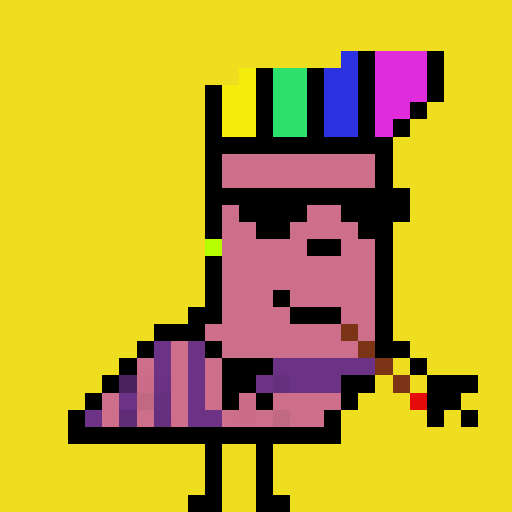

# LarvaLarms

幼虫 幼虫有腿和手臂。他们喜欢四处走动。

Larm 拥有的腿越多，它的移动速度就越快。LarvaLarms NFT - 常见问题（FAQ）
▶ 什么是幼虫？
LarvaLarms 是一个 NFT（不可替代代币）集合。存储在区块链上的数字收藏品集合。
▶ 有多少个 LarvaLarms 代币？
LarvaLarm 有 2,563 个 LarvaLarm。 目前，26 个LarvaLarm 中至少有一个 NTarm
▶最近售出多少个LarvaLarm？
过去30个卖Larms NFT。LarvaLarms 是一个 NFT（不可替代代币）集合。存储在区块链上的数字艺术品集合。 ▷ 存在多少个 LarvaLarms 代币？总共 ...

