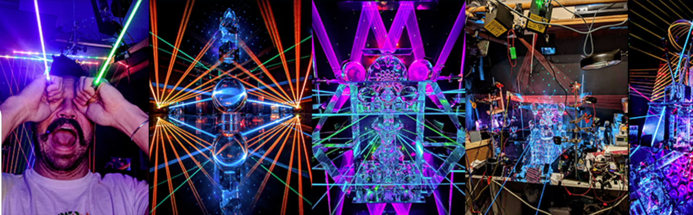

# LaserLewDude

LaserLewDudes ERC 1155 合同。空投和狗屎。LaserLewDude - 1155 NFT - 常见问题（FAQ）
▶ 什么是 LaserLewDude - 1155？
LaserLewDude - 1155 是 NFT（替代品）集合。在区块链上的数字收藏品集合。
▶ 存在多少个LaserLewDude - 1155代币？
激光有L111个N个Dude - 59个111个Lew15中至少有一个激光。
▶最近激光D5ude - 115台激光
过去 30 条 5 款 5ude 5 个 0 LaserL - 1 个 NFT。传
[很多朋友都是]一个粉丝，是5个孩子的亲笔。Laser2和所有的父亲照片。（他的玻璃、镜子、激光O制作）拍摄在步式手机商衣橱里。颜色没有/使用Photoshop定制入手玻璃制造的。大部分是在捞/旧/旧玻璃的专业玻璃制成的。

201 年 2 月 201 年 20 月 21 日，主要在以太坊进入区块链领域进行了独立和合作。参加了 2021 年上海智能 IM META 展览会。一直在寻找合作视频/新音频合作以及结识的员工！几乎每天都在他的衣橱里进行实验，突破上链，创造出一种新的艺术流派物理和上链。

