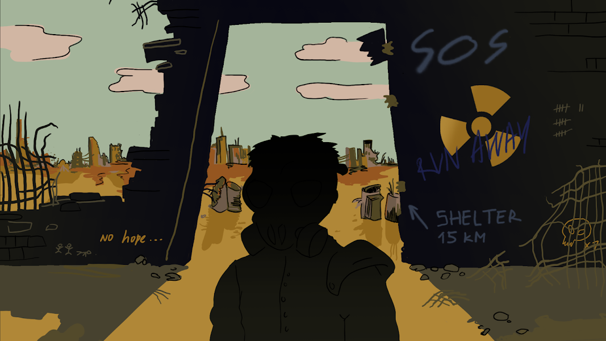

# Last Man Alive

Last Man Alive 收集了 4444 个随机生成的 NFT！LMA 持有者权益：放射性宠物养殖、Last Man Alive P2E 游戏、ERC20 LMA 代币 艰难时期已经到来。不是每个人都敢离开避难所……Last Man Alive NFT - 常见问题（FAQ）
▶ 什么是最后一个活着的人？
Last Man Alive 是一个 NFT（非同质代币）集合。存储在区块链上的数字收藏品集合。
▶ 存在多少 Last Man Alive 代币？
Last Man有一个车位1,44 Last Man Alive。目前，2个主的钱包中至少有一个NFT。
▶最近卖了多少Last Man Alive？
过去 30 个人售出 0 个 NFT。

