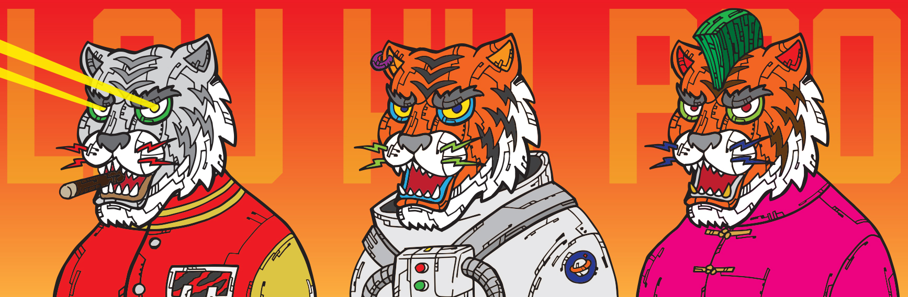

# Lau Hu Pao

为庆祝虎年，Lau Hu Pao 是由迪士尼前总裁兼艺术家 MochSarm 创作的 3,333 件生成的手绘老虎艺术收藏品。每件老虎艺术作品都采用酷炫且具有美学吸引力的服装和配饰，并将艺术家的标志性笔触风格应用于所有艺术作品。今年五月的虎年，给了刘虎报持有人勇气和信心，将聪明的想法付诸实践，同时保持慷慨，永远为弱者挺身而出。刘虎报 NFT - 常见问题（FAQ）
▶ 什么是六宝？
Lau Hu Pao 是一个 NFT（Non-fungible token）集合。存储在区块链上的数字收藏品集合。
▶ 有多少个刘虎报代币？
那个刘位车报916个刘虎报NFT。目前有472个主的钱包里至少有一个刘虎F。
▶最近卖了多少个六合包？
过去 30 个 Hu售出 Pa 0 个 Lau NFT。

