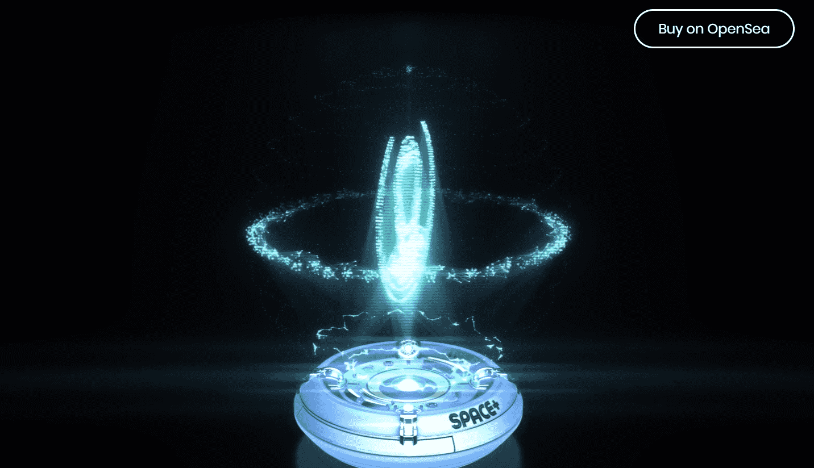

# SPACE+ - Launch Pass

@upliftaerospace 的 NFT 集合，其中代币兼作 IRL 访问空间的会员资格。Web3 太空计划，增加空间的可及性和多样性。

SPACE+ - Launch Pass 是一个 NFT（不可替代代币）集合。存储在区块链上的数字艺术品集合。总共有 1 个 SPACE+ - Launch Pass NFT。目前，612 位所有者的钱包中至少有一个 SPACE+ - Launch Pass NTF。

