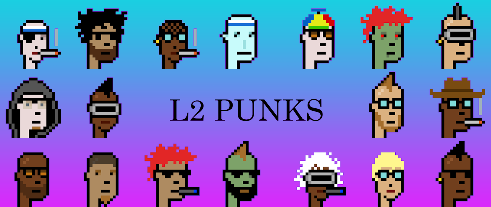

# Polygon L2 Punks

第 2 层朋克都是唯一生成的 10,000 个 CryptoPunk NFT，存储在第 2 层（多边形）区块链上。

你现在可以[铸造](https://layer2punks.app/)你的 L2 朋克了！L2 Punks NFT - 常见问题（FAQ）
▶ 什么是L2朋克？
L2 Punks 是一个 NFT 标记（不可替代）集合。存储在区块链上的数字收藏品集合。
▶ 有多少 L2 Punks 代币？
L20个Punks，69位L2NFT。目前69位车主的钱包中至少有一个Punks。
▶最近？多少了 L2 Punk
过去 30 个售出 0 个 L2 个 NFT。过去 7 天没有售出 L2 Punks。

