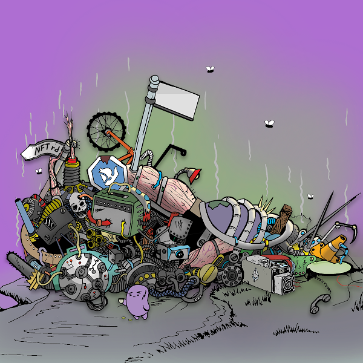

# Leftovers.WTF

剩菜快照完成！！即将到来的剩余通行证福利.....$BTASTE 👀

1. ᒪEᖴTOᐯEᖇᔕ.ᗯTᖴ ᑭᗩᔕᔕ = 1 ᑎᑌᑕᒪEᗩᖇ ᖇEᒍEᑕTᔕ ᑎᖴT

1 ᒪEᖴTOᐯEᖇᔕ + 1 ᑎᑌᑕᒪEᗩᖇ ᖇEᒍEᑕTᔕ= $ᗷTᗩᔕTE ᖴᖇEE ᑕᒪᗩIᗰ!!Leftovers.WTF NFT - 问题常见（FAQ）
▶ 什么是Leftovers.WTF？
Leftovers.WTF 是一个 NFT（Non-fungible token）集合。在区块链上的数字收藏品存储集合。
▶ 有多少剩饭剩菜.WTF 代币？
8个F有一个剩余的3,36个。WTF NFT。现在59个F有一个剩余的中间。WTF。
▶ 什么是最昂贵的Leftovers.WTF 销售？
出卖的最贵的剩饭剩菜。WTF NFT 是 6409。它于 2022 年 6 月 26 日（2 个月前）以 38.4 美元的价格售出。
▶最近卖了多少Leftovers.WTF？
过去 30 件 FTF 剩余 154 件。
▶ Leftovers.WTF 需要什么？
在30天，剩余的。
▶ 什么是流行的 Leftovers.WTF 替代品？
WTF NFT 的用户还拥有 Mutant Hua、LostMyColor、Notorious Kings NFT 和 trollcave.wtf。

