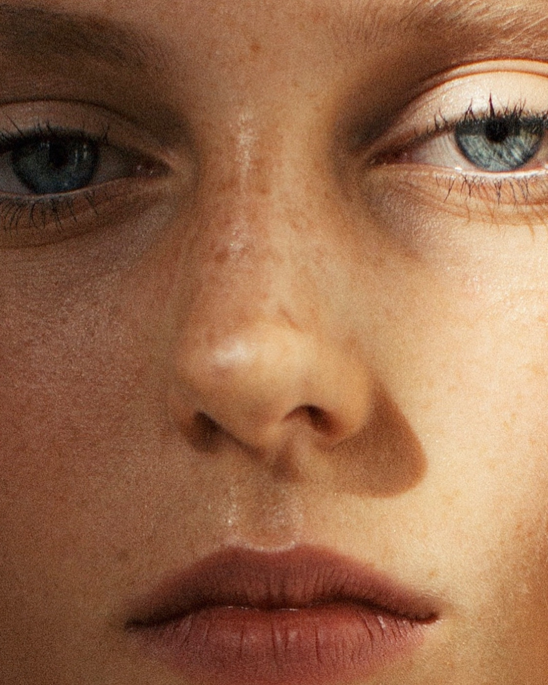

# Legendary Collection x Laurent Castellani

我是一名来自巴黎和雷岛的法国摄影师，首先是艺术总监超过 15 年，我有机会与巴黎所有最大的传播机构合作。我为 Bose 和 Bang & Olufsen 拍摄的前 2 部电影以及我的“Terrence Malick”风格非常受关注，Netflix 于 2018 年联系了我。手持相机，敏捷，我喜欢通过靠近我的身体来感受我拍摄对象的“脉搏”框架。如此多的独特标志塑造了我的摄影风格。今天，我以极简主义和非常专注的图像而闻名，我的第一本书“rêverie”销往世界各地。

