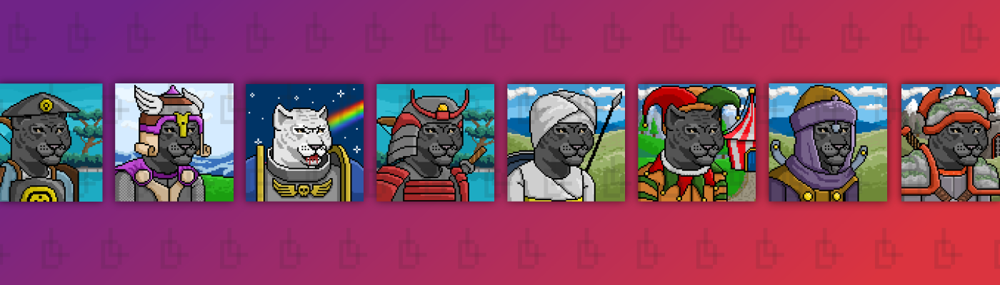

# Leopards Dynasty Old

Leopards Dynasty Old NFT - 问题常见（FAQ）
▶ 什么是豹子王朝？
Leopards Dynasty Old 是一个 NFT（非同质代币）系列。存储在区块链上的数字收藏品系列。
▶ Leopards Dynasty 旧代币有多少？
一个Leopards代车主的钱包中至少有一个Leopards Dynasty Old NTFT。目前，60位Leopards Dynasty Old NTFT。
▶最近卖了多少只豹子王朝？
过去 30 天共售出 0 个 Leopards Dynasty Old NFT。Leopards Dynasty 是一款 NFT 艺术项目和 P2E 游戏。这是一个史诗般的艺术收藏品，代表了主人的精神。王朝有 3333 只豹子，您必须在大型薄荷活动中与它们建立联系，每只豹子都希望与人类朋友合作
