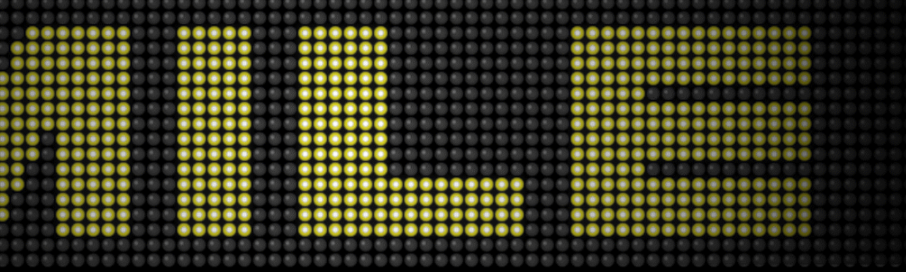

# LetSmile

LetSmile，它的诞生是为了感谢 OG 社区在这几个月的工作中给予的支持。由于 6 月 22 日是我们敬爱的艺术家的生日，因此将在以太坊区块链中铸造一份特别的礼物。到目前为止，Puppets 一直在观察，但现在是时候通过创建新内容来进行矢量化了，以便在 web3 空间上传播风格。LetSmile NFT - 常见问题（FAQ）
▶ 什么是LetSmile？
LetSmile 是一个标志性的 NFT（不可替代）收藏在区块链上的数字收藏品集合。
▶ 有多少个LetSmile代币？
个主有一个Smile NFT。目前60个车中至少有一个LetSmile NT。
▶ 最贵的 LetSmile 销售是什么？
最昂贵的 LetSmile NFT 是 LetSmile #39。它在 2022-07-02（大约 2 个月前）以 526.9 美元的价格售出。
▶最近直接了多少？ LetSmile
过去 30 个用户提供 3 个 LetSmile NFT。

