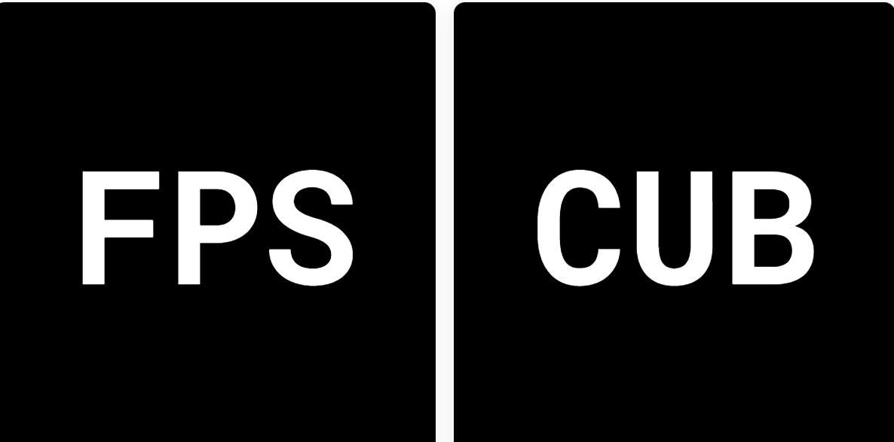

# Letters by Characters

Letters 是 Characters Group 的 6,566 个独特、3 个字母、可定制的 NFT 的集合。每个代币都可以访问大量实用程序，例如 $CHAR 实用程序代币的每日收入、CharDAO 的成员资格和投票权、NFT 定制、访问未来项目等。NFT - 常见问题（FAQ）
▶ 什么是逐字逐字？
Letters by Characters 是一个 NFT（不可替代标记）集合。存储在区块链上的数字收藏品集合。
▶ 有多少个Letter by Characters 代币？
有66个字母的字母NFT。现在，61个字母的字母中至少有一个NT。
▶最近是多少个字母？
在过去 30 个字母由 0 个字母 NFT 提供。

