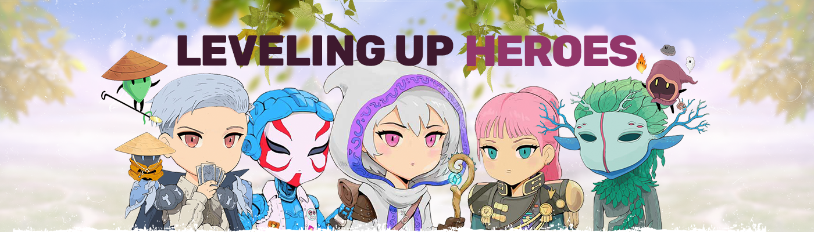

# Leveling Up Heroes - Magical Tier

升级英雄 - 魔法层 - 第1阶段 NFT - 常见问题（FAQ）
▶ 什么是升级英雄-魔法层-第一阶段？
阶段是一个NFT（不可替代）集合。存储在区块链上的数字收藏品集升级 - 魔法层 - 第1
▶ 有多少层英雄升级阶段 - 魔法 - 1代币？

- 第4层的第4层有第5层的英雄升级 - 魔法层第1层。现在魔法层至少有5个英雄层1.7层。
▶ 什么是魔法最昂贵的升级英雄 - 层级 - 第一级销售？
最昂贵的英雄升级-魔法层-阶段1 Nft是升级英雄-魔法#1067。它于 2022-06-06 （3个以以前以以 以 以 以 以 以 以 以 90.7 美元 的价格 售出 售出 售出 售出 售出 售出 售出出卖出
▶ 升级英雄层-第一层最直接了-多少？
过去30层升级共售出——6个魔法阶段1个NFT。
▶ 什么是流行的英雄升级 - 魔法层 - 第一阶段替代品？
拥有升级英雄-魔法层-第一阶段NFT的用户还拥有DerpDerp DerpDerp、Wicked Craniums Comic、Char0和Toy Frens。
- 
