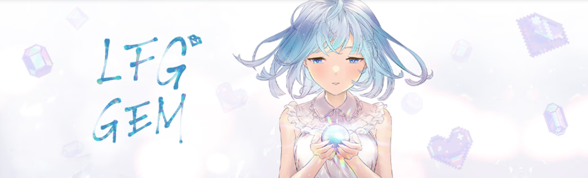

# LFG Gem NFT

LFG Gem NFT NFT - 常见问题（FAQ）
▶ 什么是 LFG 宝石 NFT？
LFG Gem NFT 是一个 NFT（不可替代代币）集合。存储在区块链上的数字收藏品集合。
▶ 存在多少 LFG Gem NFT 代币？
304个LFG宝石77,63个NT。目前14个N个FG中至少有一个N个F宝石。
▶ 最昂贵的 LFG Gem NFT 销售是什么？
最贵的 LFG Gem NFT NFT 是 LFG GEM NFT。它于 2022-06-11（3 个月前）以 31.4 美元的价格售出。
▶最近一次精确到多少？
过去 30 个 FT 出售 LFG 255 个 Gem NFT N。
▶ LFG Gem NFT 的成本是多少？
在过去 30 美元的 Gem NFT 中，Gem NFT 的价格是最便宜的 3 美元，超过 GLF NFT 的 30 美元。
▶ 有哪些流行的 LFG Gem NFT 替代品？
拥有 LFG Gem NFT NFT 的用户还拥有 Moosh Official、 HobgoblinNFT、 Butties 和 Goblin Goons。
 购买N个球FT项目：立即购买。

