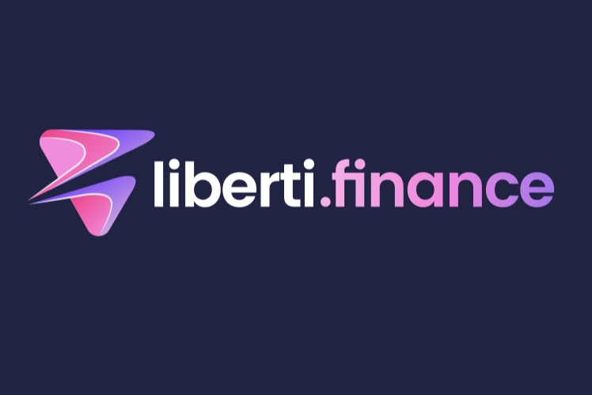

# Liberti.Finance

Liberti Finance DeFi 平台。小比特币挖矿。Liberti (LBT) 是 TRC-20 代币和 TRON 网络的数字资产。 Liberti 代币是支持和发展可持续 Liberti 去中心化金融 (DeFi) 生态系统的资本主题之一。Liberti Finance——一个基于区块链的项目，允许您下注并获得代币作为回报。此外，您可以参加推荐计划...我们的学术课程旨在帮助您在管理和扩展企业的各个方面表现出色。无论您是想创办一家新企业，...Contact. 邮件创业在凯洛格团队 邮件创业在凯洛格团队 · 847.491.8876 847-491-8876 · *Twitter* Follow Us on *Twitter* · Events. 龙8游戏官方网站全年为学生举办创业 ...

