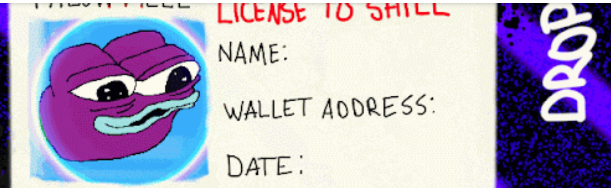

# LICENSE TO SHILL

本 SHILL 许可在此授予被许可人 100% 吹嘘的权利，同时 SHILL 为持有本许可而获得的收益。SHILL NFT 许可 - 常见问题（FAQ）
▶ 什么是 LICENSE TO SHILL？
LICENS TO SHILL 是一个 NFT（替代令牌）集合。存储在区块链上不可链上的数字收藏品集合。
▶ 有多少个 LICENSE TO SHILL 代币？
LLF 有 11 个 LICENSE TO SHI。目前，3 个 N 位的钱包中至少有一个 LICENS。
▶ 最贵的 LICENSE TO SHILL 销售是什么？
销售的最贵的 LICENSE TO SHILL NFT 是 LICENSE TO SHILL。它于 2022-06-13（3 个月前）以 295.8 美元售出。
▶最近取得了多少 LICENS TO LICENS？
在过去的 30 件普通话中，有 11 个 NFT。
▶ LICENSE TO SHILL的费用是多少？
过去 30 到 30 美元的 LICENSE 到 30 美元的 SHILL 价格最便宜的 81 美元，最高 2 91 美元。过去 3 天 LICENSE NFT 的价格超过 220 美元。
▶ 有哪些流行的 LICENSE TO SHILL 替代品？
拥有 LICENSE TO SHILL NFT 的用户也拥有 BABLA STUFF ED。、Virtuoso World 、[普通的工具] 和 MANIC24。
